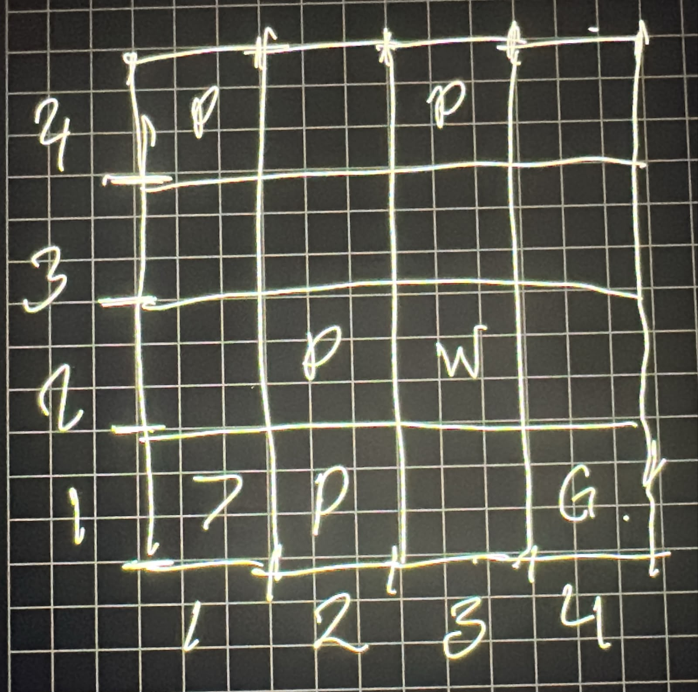
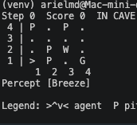
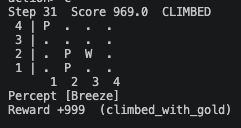
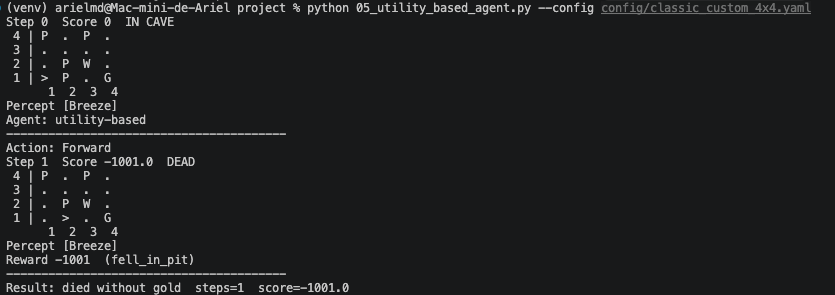
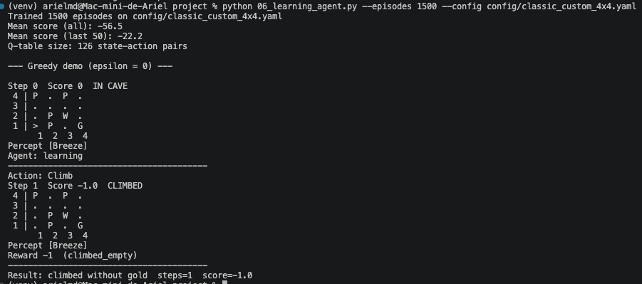

# Actualización de la cueva del Wumpus

Primero se diseño al estructura que iba a tener la cueva 4x4 buscando que tenga solución.

    <figure>
        
        <figcaption>Figura 1. Diseño de la cueva.</figcaption>
    </figure>
    <figure>
        
        <figcaption>Figura 2. Diseño de la cueva.</figcaption>
    </figure>

Los agentes simple_reflex_agent, model_based_agent, goal_based_agent se ciclaban y solamente giraban a la izquierda, ya que al iniciar el camino se percibía una brisa e intentaban girar evitandolo. A pesar que el mapa si tenia solución. La razón es porque no podían encontrar una ruta segura hacia el oro por lo que se mantenía girando hasta terminar los movimientos máximos.

<figure>
    
    <figcaption>Figura 3. Partida manual terminada.</figcaption>
</figure>

Para el agente utility_based_agent calculaba el riesgo de continuar, ya que desde el inicio se percibe una brisa, por lo que intenta avanzar y siempre cae en un hoyo en el primer movimiento.

<figure>
    
    <figcaption>Figura 4. Partida terminada.</figcaption>
</figure>

Por ultimo para el learning_agent después de 1500 épocas y no encontrar y camino seguro donde pueda recuperar el oro y regresar. Aprendió que es mejor no intentarlo y simplemente salir de la cueva sin el oro con la menor puntuación posible -1.

<figure>
    
    <figcaption>Figura 5. Partida con agente de aprendizate terminado</figcaption>
</figure>

Al final como ningun agente pudo completar la partida con la configuración se opto por eliminar el hoyo de las coordenadas (2,1).

Todos los agentes tuvieron el mismo resultado excepto el learning_agent que con la nueva configuración fue el único que logró ir hacia el oro y regresar. 

<figure>
    
    <figcaption>Figura 6. Partida completada.</figcaption>
</figure>