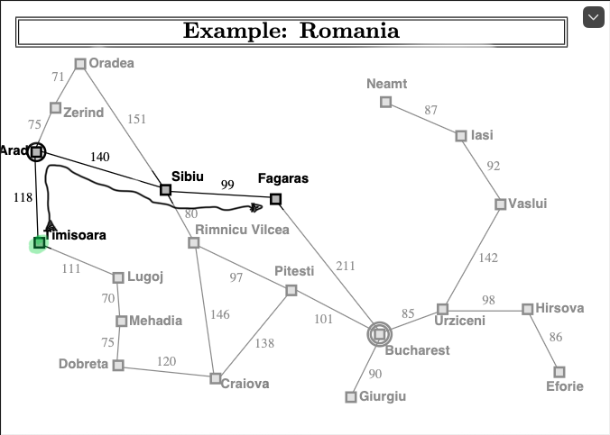
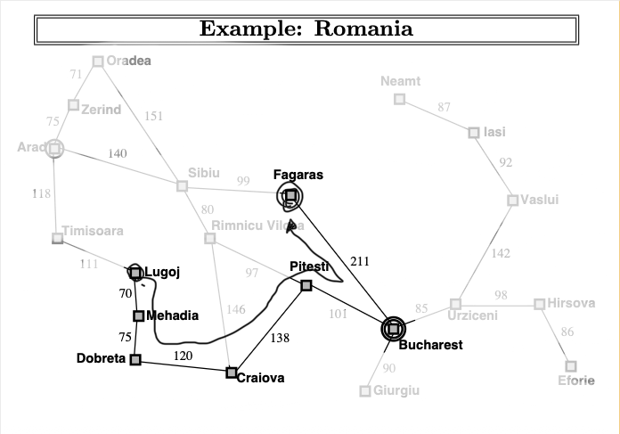

#  Búsqueda no informada

Para esta actividad se eligió las ciudades Lugoj como inicio y Fagaras como final.

[Captura de la terminal](imagenes/terminal.png)

1. Algoritmo breadth_first_search.py

```bash
(venv) arielmd@Mac-mini-de-Ariel project % python 02_breadth_first_search.py --from-city Lugoj --to Fagaras
Algorithm: Breadth-first search
Problem:   Lugoj → Fagaras
Status:    success
Path:      Lugoj → Timisoara → Arad → Sibiu → Fagaras
Depth:     4 roads
Cost:      468 km
Expanded:  7 nodes
Generated: 17 nodes
Frontier:  max size 4
```

2. Algoritmo uniform_cost_search.py

```bash
(venv) arielmd@Mac-mini-de-Ariel project % python 03_uniform_cost_search.py  --from-city Lugoj --to Fagaras
Algorithm: Uniform-cost search
Problem:   Lugoj → Fagaras
Status:    success
Path:      Lugoj → Timisoara → Arad → Sibiu → Fagaras
Depth:     4 roads
Cost:      468 km
Expanded:  11 nodes
Generated: 29 nodes
Frontier:  max size 4
```

<figure>
    
    <figcaption>Figura 1. Ruta generada para Breadth-first search y Uniform-cost search.</figcaption>
</figure>

3. Algoritmo depth_first_search.py
```bash
(venv) arielmd@Mac-mini-de-Ariel project % python 04_depth_first_search.py   --from-city Lugoj --to Fagaras
Algorithm: Depth-first search
Problem:   Lugoj → Fagaras
Status:    success
Path:      Lugoj → Mehadia → Drobeta → Craiova → Pitesti → Bucharest → Fagaras
Depth:     6 roads
Cost:      715 km
Expanded:  6 nodes
Generated: 17 nodes
Frontier:  max size 5
```

<figure>
    
    <figcaption>Figura 2. Ruta generada para .</figcaption>
</figure>

4. Algoritmo depth_limited_search.py

```bash
(venv) arielmd@Mac-mini-de-Ariel project % python 05_depth_limited_search.py --from-city Lugoj --to Fagaras --limit 2
Algorithm: Depth-limited search
Problem:   Lugoj → Fagaras
Status:    cutoff
Detail:    limit=2
Expanded:  3 nodes
Generated: 7 nodes
Frontier:  max size 4
```

5. Algoritmo breadth_first_search.py
```bash
(venv) arielmd@Mac-mini-de-Ariel project % python 05_depth_limited_search.py --from-city Lugoj --to Fagaras --limit 4
Algorithm: Depth-limited search
Problem:   Lugoj → Fagaras
Status:    success
Detail:    limit=4
Path:      Lugoj → Timisoara → Arad → Sibiu → Fagaras
Depth:     4 roads
Cost:      468 km
Expanded:  7 nodes
Generated: 14 nodes
Frontier:  max size 8
```

6. Algoritmo iterative_deepening_search.py
```bash
(venv) arielmd@Mac-mini-de-Ariel project % python 06_iterative_deepening_search.py --from-city Lugoj --to Fagaras
Algorithm: Iterative deepening search
Problem:   Lugoj → Fagaras
Status:    success
Detail:    last_limit=4
Path:      Lugoj → Timisoara → Arad → Sibiu → Fagaras
Depth:     4 roads
Cost:      468 km
Expanded:  16 nodes
Generated: 37 nodes
Frontier:  max size 8
```

<figure>
    
    <figcaption>Figura 3. Ruta generada para Iterative deepening search y Depth-limited search.</figcaption>
</figure>


## Reporte

Los algoritmos de BFS y UCS encontraron el mismo camino (Lugoj → Timisoara → Arad → Sibiu → Fagaras), porque coincidió que 4 caminos es el mínimo para llegar a fagaras que es lo que busca el algoritmo de BFS busca las opciones de los nodos buscando por nivel y cada vez desarrollando los nodos hijos y coincidió que también es el camino con menos costo de 468 km.

Otro camino pudo ser Lugoj → Mehadia → Drobeta → Craiova → Pitesti → Bucharest → Fagaras pero para llegar se necesito una 6 caminos (profundidad) y un costo 715 km. Este resultado fue obtenido por el algoritmo de DFS y la razón por porque expande todos los nodos hijos hasta encontrar el resultado. En este caso las opciones eran Lugoj → Timisoara y Lugoj → Mehadia, pero como se ordena por orden alfabético y se utiliza una pila FIFO el que se proceso primero fue Mehadia y como encontró un camino hacia Fagaras fue el camino mas largo con 6 caminos (profundidad)

Para DLS el cutoff=2 no alcanzo a encontrar un camino, como se mencionó el camino con menos carreteras y distancia son 4 de profundidad. Sin embargo cuando se agregaba a cutoff=4 buscaba el camino mas optimo encontrado también por el BFS y UCS.

Entender como funciona DLS es el funcionamiento del algoritmo IDS, que varia la profundidad cutoff desde 1 a N, hasta encontrar el camino con menor profundad. Combinando el DFS y BFS, ya que el cutoff evita que se explore un nodo y buscando una respuesta no óptima como sucede con BFS y va explorando los siguientes nodos. Si no encuentra la solución en la profundidad se agrega una profundidad adicional.
En este caso se necesito una profundidad de 4 y el resultado fue el mas optimo y con menos KM. 