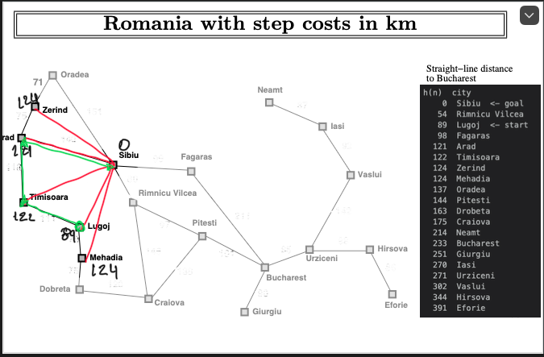
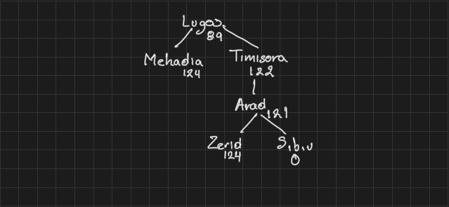
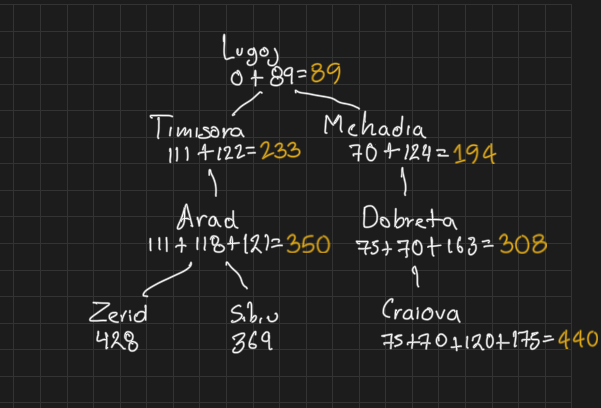

#  Búsqueda informada

Para esta actividad se eligió las ciudades `Lugoj` como inicio y `Sibiu` como final.

[Captura de la heuristica Lugoj -> Sibiu](imagenes/heuristica.png)

[Captura de Greedy best-first search](imagenes/greedy_best_first_search.png)

[Captura de A* search](imagenes/a_star_search.png)

```shell
(venv) arielmd@Mac-Ariel project % python 02_heuristics.py --from-city Lugoj --to Sibiu
Heuristic: Euclidean distance to Sibiu (map coordinates)

  h(n)  city
      0  Sibiu  <- goal
     54  Rimnicu Vilcea
     89  Lugoj  <- start
     98  Fagaras
    121  Arad
    122  Timisoara
    124  Zerind
    124  Mehadia
    137  Oradea
    144  Pitesti
    163  Drobeta
    175  Craiova
    214  Neamt
    233  Bucharest
    251  Giurgiu
    270  Iasi
    271  Urziceni
    302  Vaslui
    344  Hirsova
    391  Eforie
```

```shell
(venv) arielmd@Mac-Ariel project % python 03_greedy_best_first_search.py --from-city Lugoj --to Sibiu
Algorithm: Greedy best-first search
Problem:   Lugoj → Sibiu
Heuristic: Euclidean distance to Sibiu (map coordinates)
Status:    success
Path:      Lugoj → Timisoara → Arad → Sibiu
Depth:     3 roads
Cost:      369 km

  city                  g     h     f
  Lugoj                    0    89    89
  Timisoara              111   122   233
  Arad                   229   121   350
  Sibiu                  369     0   369

Expanded:  3 nodes
Generated: 8 nodes
Frontier:  max size 3
```

```shell
(venv) arielmd@Mac-Ariel project % python 04_a_star_search.py           --from-city Lugoj --to Sibiu
Algorithm: A* search
Problem:   Lugoj → Sibiu
Heuristic: Euclidean distance to Sibiu (map coordinates)
Status:    success
Path:      Lugoj → Timisoara → Arad → Sibiu
Depth:     3 roads
Cost:      369 km

  city                  g     h     f
  Lugoj                    0    89    89
  Timisoara              111   122   233
  Arad                   229   121   350
  Sibiu                  369     0   369

Expanded:  5 nodes
Generated: 12 nodes
Frontier:  max size 3
```

## Reporte

El resultado y el camino que se obtuvo para ambos algoritmos Greedy y A* obtuvieron el mismo resultado `Lugoj → Timisoara → Arad → Sibiu` y usaron la heurística de distancia euclidiana desde `Lugoj` hasta `Sibiu`.

Geedy comenzó calculando la distancia de los nodos Mehadia(122km) y Timisora (124km), dado que Greedy prioriza el nodo que tenga mas se acerque a Sibiu dado la heurística opto por ir hacia Timisora(122km), yendo a Arad(121km) el cual se divide en Zerid(124km) y Sibiu(121km), se prioriza Subiu llegando al destino con la heurística (0km).

A* calculo el inicio entre Timisora (111 + `122` = 233) y Mehadia (70 + `124` = 194), como el costo por ir y la distancia euclidiana entre el nodo y el destino era menor se fue expandiendo hacia mehadia pasando por Dobreta (75 + 70 + `163` = 308), hacia Craiova (75 + 70 + 120 + `175` = 440) pero se iba alejando de destino se continuo con Timisora hacia el nodo Arad (111 + 118+ `121` = 350) hasta los nodos Zerid (111 + 118 + 75 + 124 = 428) y Sibui (369 + 0) por lo que la heurística hacia Subui era cero y se llegó al destino.

Aunque ambos obtuvieron el mismo camino hacia el destino ambos desarrollaron arboles diferentes donde se fue calculando el camino. 

<figure>
    
    <figcaption>Figura 1. Ruta generada por el algoritmo Greedy y A*.</figcaption>
</figure>

<figure>
    
    <figcaption>Figura 2. Arbol generado por Greedy.</figcaption>
</figure>

<figure>
    
    <figcaption>Figura 3. Arbol generada A*.</figcaption>
</figure>
