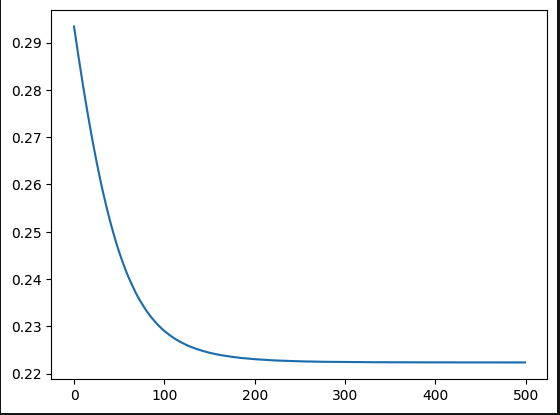
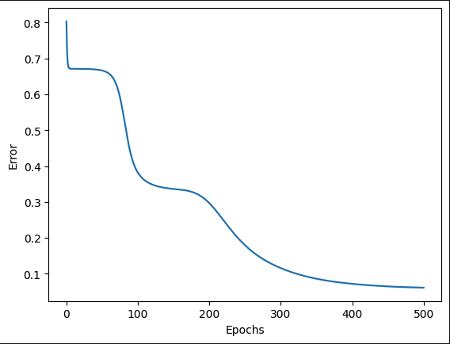
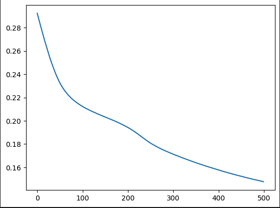
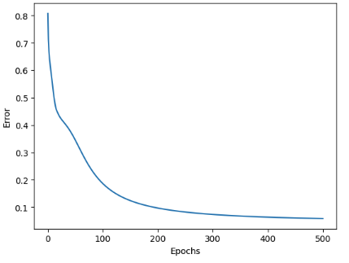

# Más capas en el perceptrón multicapa (Iris)

#### ¿Bajar más el error al añadir dos capas, o se estancó / empeoró? ¿Igual en NumPy y en Keras?

El error fue similar en ambas formas de procesar los datos con los cálculos manuales en numpy y con Keras. Lo que cambio principalmente fue la velocidad con la que el error baja en Keras. Usando dos capas ocultas alcanzó el error mínimo en menos épocas que con una capa oculta, aun asi con una capa oculta se alcanzó un error mas bajo. Para Numpy se logro un error similar al finalizar las épocas. 

#### ¿Las curvas de la notebook 01 y de Keras se parecen con la misma topología? Si no, ¿qué diferencias de implementación podrían explicarlo (orden de los datos, inicialización, vectorización, etc.)?

Las graficas de error de Keras para los diferentes modelos de una y dos capas ocultas la forma de la grafica fue similar. Lo que se diferencia con la implementación con Numpy es que ambos se generaron con un error bajo desde el inicio. Su implementación fue mas fácil ya que solo se inicializa el modelo con la secuencia de las capas que tendrá. Así como escoger el algoritmo de activación en este caso sigmoidal.
Por el contrario con Numpy agregar una capa involucra inicializar los vectores, realizar los cálculos de propagación de los errores lo que puede provocar mas errores ya que el orden en que se calcula la propagación importa. Los pesos de las neuronas al iniciarse con valores aleatorios provocaba que siempre se inicie con errores altos, y en cada época de entrenamiento se lograba disminuir el error, sin embargo su forma no era suave como con Keras era escalonada.

#### Con sigmoides apiladas y MSE, ¿tiene sentido que una red más profunda no aprenda mejor en Iris? Relaciónalo con lo que viste en las gráficas.

En este caso los datos de entrenamiento de iris y sus características con pocas y se puede resolver con un modelo no complicado, con una capa oculta de neuronas es suficiente para clasificar, agregar mas capas haciendo una red mas profunda las activaciones sigmoidales y error cuadrático medio (MSE) puede que no obtenga un mejor rendimiento en el conjunto de datos Iris, e incluso se vuelva más difícil de entrenar.

#### Perceptron multicapa

    <figure>
        
        <figcaption>Figura 1. Errores con una capa oculta</figcaption>
    </figure>
    <figure>
        
        <figcaption>Figura 2. Errores con una dos oculta</figcaption>
    </figure>

#### Perceptron multicapa Keras

    <figure>
        
        <figcaption>Figura 3. Errores con una capa oculta</figcaption>
    </figure>
    <figure>
        
        <figcaption>Figura 4. Errores con una dos oculta</figcaption>
    </figure>

