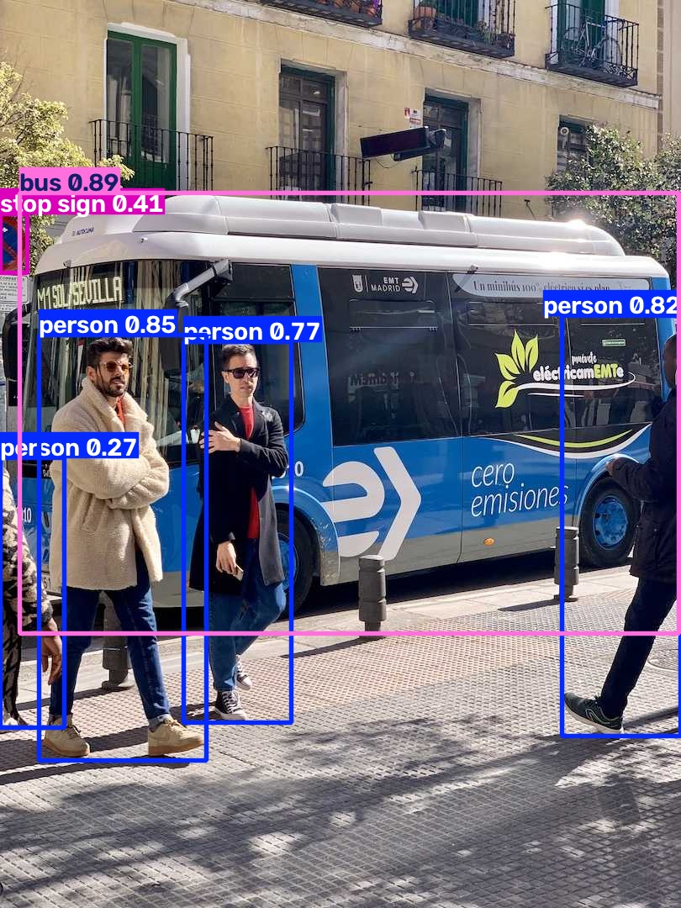
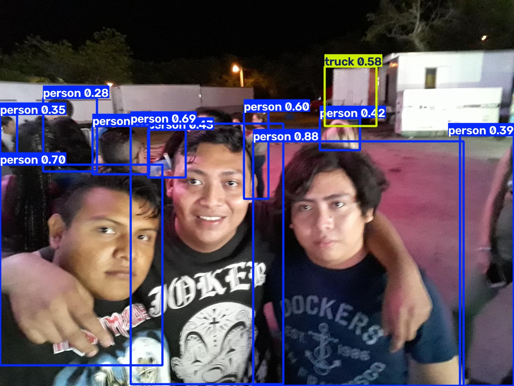
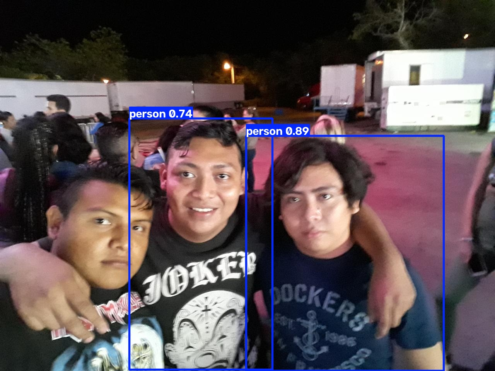
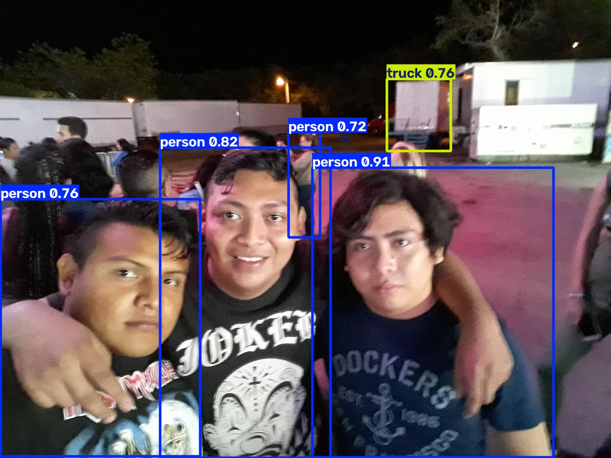

#  Cambiar la imagen de predicción en YOLO

En esta activiadad para la deteccion de patrones atraves de la vision computacional con yolo.

### ¿Qué clases detectó YOLO en las fotos de Ultralytics y cuáles en la tuya?

En las foto de del bus para usando YOLO se detectaraon 4 personas, 1 autobus y una señal de alto.

En la foto que use para validarlo con el modelo, se encontro 12 personas y un camnion.

Algo que se detecto en ambos ejemplos fue que la prediccion lo hace aunque sea parcial el cuerpo de una persona que sale lo cuenta como una persona, aunque sea la misma o solo es una parte visible.

### ¿Algún objeto evidente de tu foto no salió etiquetado? ¿Por qué podría pasar (clase que no está en COCO, objeto chico, recorte, umbral de confianza)?

Una casa podria ser, fue el unico objeto que no se etiqueto correctamente y no se dectecó, podria ser porque no tuvo los datos para entrenar y detectar una casa o porque los datos con los que fue entregado no coinciden con la arquitectura que se usa en la peninsula.

### ¿La predicción de la celda CLI y la de model(...) coinciden sobre tu misma imagen?

En este caso no, se con el CLI usando el modelo yolov8n con una alta restriccion con un umbral mas estricto se obtuvo una reduccion de objetos etiquetados en la imagen, pero los etiquetados tenian un mayor porcentage de coincidir con la etiqueta. 

Comprandolo con el CLI pero usando un modelo yolov8s se obtuvo una cantidad de 4 personas y el camnion con mejor de porcentaje de etiquetado.

    <figure>
        
        <figcaption>Figura 1. Etiquetado del autobus</figcaption>
    </figure>
    <figure>
        
        <figcaption>Figura 2. Etiquetado de zidane</figcaption>
    </figure>

    <figure>
        
        <figcaption>Figura 3. Etiquetado del autobus</figcaption>
    </figure>
    <figure>
        
        <figcaption>Figura 4. Etiquetado con estricción y yolov8n.pt</figcaption>
    </figure>

<figure>
    
    <figcaption>Figura 5. Etiquetado con modelo yolov8n.pt</figcaption>
</figure>
