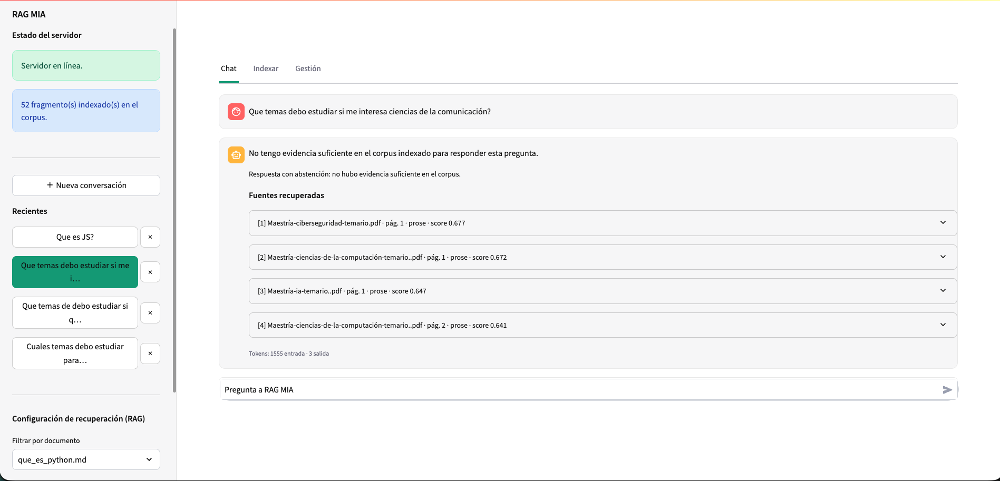

# Sistema RAG

Pipeline de **generación aumentada por recuperación (RAG)**: incrustar → indexar → recuperar top-k → generar respuesta anclada con citas.

| Capa | Tecnología |
|------|------------|
| UI | Streamlit (`localhost:8501`) |
| API | FastAPI (`localhost:8000`, OpenAPI en `/docs`) |
| Índice | ChromaDB persistente en `./chroma` |
| Embeddings | Google AI (`gemini-embedding-001`) |
| Generación | Gemini (`gemini-3.8-flash`) |

La UI **solo** habla con FastAPI por HTTP. No accede a Chroma ni a Google AI directamente.

## Requisitos

- Python 3.11+
- Cuenta en [Google AI Studio](https://aistudio.google.com/apikey) y API key

## Instalación

```bash
cd rag-app
python -m venv .venv
source .venv/bin/activate   # Windows: .venv\Scripts\activate
pip install -r requirements.txt
cp .env.example .env
```

Edita `.env` y define:

```env
GOOGLE_API_KEY=tu_clave_aqui
```

## Ejecución

**Terminal 1 — API**

```bash
cd rag-app
source .venv/bin/activate
uvicorn app.main:app --reload --host 0.0.0.0 --port 8000
```

**Terminal 2 — UI**

```bash
cd rag-app
source .venv/bin/activate
streamlit run ui/streamlit_app.py --server.port 8501
```

Abre `http://localhost:8501` y verifica la API en `http://localhost:8000/docs`.

## Preparar tu corpus

1. - Existe archivos en la carpeta `/data` donde se encuentra PDFs de temarios para diferentes maestrias de la UADY y 2 markdown sobre el tema de python.
   - sube archivos, o pulsa **Indexar carpeta data/** (si ya copiaste archivos allí).
3. En **Consultar**, haz preguntas in-domain y una fuera de dominio.

### PDFs con tablas y JSON/XML

La extracción PDF usa `pdfplumber` para tablas (Markdown) y heurísticas para bloques JSON/XML embebidos. PDF escaneado (solo imagen) no está soportado sin OCR.

## Endpoints principales

| Método | Ruta | Descripción |
|--------|------|-------------|
| GET | `/health` | Estado API + Chroma |
| POST | `/ingest` | Subida multipart y/o `index_data_dir=true` |
| POST | `/query` | `{ "question", "top_k?", "source?", "chat_id?" }` |
| GET | `/chats` | Lista de conversaciones persistidas |
| GET | `/chats/{id}` | Conversación completa (turnos + tokens) |
| POST | `/chats` | Crear conversación vacía |
| DELETE | `/chats/{id}` | Borrar conversación |
| GET | `/sources` | Fuentes y conteo de chunks |
| DELETE | `/sources/{source}` | Borrar documento del índice |
| POST | `/sources/{source}/reindex` | Reemplazar un documento |

## Regla de abstención

1. **Pre-LLM:** si no hay chunks o el mejor `score < ABSTAIN_MIN_SCORE` (default `0.35`, similitud `1 - distancia_coseno_chroma`), la API responde con abstención sin llamar a Gemini.
2. **Post-LLM:** si Gemini devuelve `ABSTAIN` o no hay citas `[n]` con evidencia débil, se fuerza abstención.

Mensaje típico: *«No tengo evidencia suficiente en el corpus indexado…»*

## Variables de entorno

Ver [`.env.example`](.env.example). Destacadas:

- `EMBEDDING_PROVIDER=google` (alternativa `local` con sentence-transformers; reindexar si cambias)
- `CHUNK_MAX_WORDS`, `CHUNK_OVERLAP_WORDS`
- `TOP_K_DEFAULT`, `ABSTAIN_MIN_SCORE`
- `CHATS_DIR` (JSON de conversaciones; no se versionan)
- `GEMINI_INPUT_USD_PER_1M`, `GEMINI_OUTPUT_USD_PER_1M` — **estimación local** del costo (no es la factura de Google)

## Conversaciones persistentes

Los chats se guardan en `chats/` a través de FastAPI. Recargar Streamlit o reiniciar la API **no** borra el historial. Cada turno guarda pregunta, respuesta, citas, tokens de Gemini y un costo estimado. El historial **no** se reinyecta al modelo: cada pregunta se responde solo con evidencia recuperada.

## Mensajes en la terminal (no suelen ser fallos)

| Mensaje | Significado |
|---------|-------------|
| `FutureWarning` Python 3.9 + `google-auth` | Aviso de versión de Python; conviene usar **Python 3.11+** y recrear el venv. |
| `chromadb... posthog... capture()` | Telemetría interna de ChromaDB; el proyecto la desactiva con `ANONYMIZED_TELEMETRY=False`. |
| `AFC is enabled with max remote calls` | Información normal del SDK de Google al generar la respuesta. |

Ejemplo:

